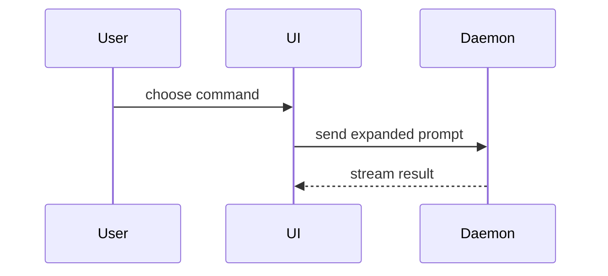

# Show me

Help the user understand the current topic visually. Skip the preamble and keep prose short. Pick the smallest view that makes the key point clear.

## Language

English is the user's second language. Use short sentences and common words. Avoid idioms and slang. Technical terms are fine.

## Views

- Logic or an algorithm as pseudocode:

```text
on(save)
  if content is unchanged
    return cached result
  write new content
  return fresh result
```

- Runtime control flow as a call tree:

```text
submitForm
  createSession
    persistPrompt
    launchAgent
  navigateToSession
```

- UI structure as a component tree, with the state and module boundaries that matter:

```tsx
<SessionPage> (apps/example/src/routes/session.tsx)
  useSessionEvents()
  <SessionToolbar>
    <RunSkillButton> (packages/ui)
```

- File responsibility or a broad refactor as a shallow file tree:

```text
src/
├── commands/       # parses user actions
├── sessions/       # owns session state
└── transport/      # sends API requests
```

- Component interaction, control flow, or data flow as Mermaid:



- A `diff` when the point is what changes and the surrounding shape already exists. Match the diff to the view it changes (component tree, file tree, call tree, or control flow):

```diff
 src/
 ├── commands/
+│   └── show-me.ts       # expands the slash command
 ├── sessions/
-└── transport.ts
+└── transport/
+    ├── client.ts
+    └── stream.ts
```

- The whole code block when most of it is new, when leaving out context would hide ownership or order, or when the user needs a target shape to copy.

- For a visual UI, a layout, a state comparison, or a concept too dense for Mermaid: write one focused HTML file (a diagram, an infographic, or a short slide deck). Match the product's colors, type, spacing, and components. Use real labels and data. Support desktop and mobile. Save it in the OS temp directory (not the repo) as `show-me-<topic>.html`, then open it (`open <file>` on macOS, `xdg-open <file>` on Linux) and tell the user the path.

## Guidance

Place each visual next to the short text it supports. Keep only the calls, files, props, states, and boundaries needed to answer the user's current question, or the options that resolve the current discussion point.

Use one view, or a few. You will almost never need all of them. Don't overwhelm the user.
